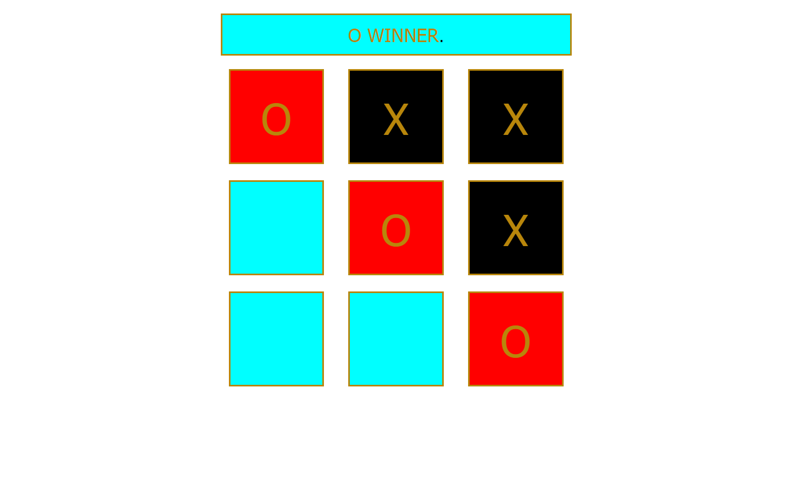

# XO Game
## Overview:
The XO Game, also known as Tic-Tac-Toe, is a classic two-player game where opponents take turns marking spaces in a 3x3 grid. The objective is to align three of their symbols (X or O) horizontally, vertically, or diagonally.

## How to Play:

- Players take turns clicking on an empty cell to place their symbol.
- The game alternates between X and O until one player achieves three in a row or the grid is full.
- The game announces the winner or declares a draw.

Enjoy the timeless fun of XO Game with a friend or test your strategy against the computer! 🎲🕹️

